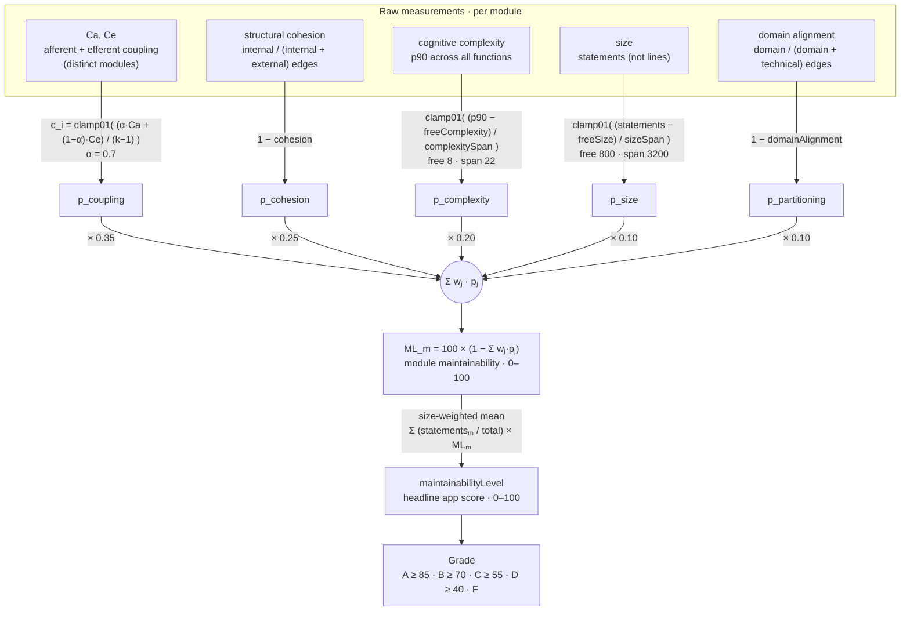

# Maintainability level — `ML`, `Grade`

[← All metrics](README.md)

**The headline score: one number per module, and one for the application.**

| | |
|---|---|
| **The idea** | No single metric describes maintainability, so the five the book lists are each turned into a *penalty* and combined into one number you can track over time. |
| **Where it comes from** | The book's own `ML` formula is illustrative rather than operational ([why](coupling.md#the-application-level-figures)), so the metrics are combined here as a weighted penalty sum. |
| **Computed here** | `ML_m = 100 × (1 − Σ wⱼ·pⱼ)` per module, `0–100`, higher is better; the app figure is the **size-weighted** mean of those. |
| **Impact on `ML`** | It *is* the score. Every other metric reaches the headline through it. |
| **Bands** | A ≥ 85 · B ≥ 70 · C ≥ 55 · D ≥ 40 · F below |
| **Source** | [`computePenalties`](../../src/scoring/penalties.ts#L15), [`maintainabilityLevel`](../../src/scoring/penalties.ts#L35), [`aggregateScope`](../../src/scoring/aggregate.ts#L30) |

The rest of this document is the complete definition: the pipeline diagram, the penalties, the
weights, the application-level aggregation and the letter grades.

> `ML` is the maintainability *level* (`maintainabilityLevel`). It is distinct from the
> coupling-only application figure `meanCoupling`, which is explained in
> [coupling § the application-level figures](coupling.md#the-application-level-figures).

---

## The pipeline

Every box on the left is a metric the tool measures per module; every edge label is the exact
transform applied, including the tunable constants ([README §4](../../README.md#4-configuration))
that shape it.



Every constant in the diagram is a config knob ([README §4](../../README.md#4-configuration)): the
afferent weight `α`, the `weights` (`wⱼ`), the `free…`/`…Span` thresholds, and the `grades`
cutoffs. `k` is the number of modules (including pseudo-modules); `clamp01` bounds each penalty to
`[0, 1]`. The penalties are produced by [`computePenalties`](../../src/scoring/penalties.ts#L15),
combined by [`maintainabilityLevel`](../../src/scoring/penalties.ts#L35), and rolled up to the
application by [`aggregateScope`](../../src/scoring/aggregate.ts#L30).

---

## The penalties

Each metric becomes a penalty in `[0, 1]` where 0 means no problem:

```
p_coupling     = c_i
p_cohesion     = 1 − cohesion(m)
p_complexity   = clamp01( (cognitiveP90(m) − freeComplexity) / complexitySpan )
p_size         = clamp01( (statements(m) − freeSize) / sizeSpan )
p_partitioning = 1 − domainAlignment(m)

ML_m = 100 × (1 − Σ w_j × p_j)
```

Each penalty has its own document, where the measurement behind it is defined in full:

| Penalty | Metric | Weight | Document |
|---|---|---|---|
| `p_coupling` | `cᵢ` | 0.35 | [coupling](coupling.md) |
| `p_cohesion` | `Coh` | 0.25 | [cohesion](cohesion.md) |
| `p_complexity` | `CogP90` | 0.20 | [complexity](complexity.md) |
| `p_size` | statements | 0.10 | [size](size.md) |
| `p_partitioning` | `domainAlignment` | 0.10 | [partitioning](partitioning.md) |

The `free…` constants define a zone where a metric costs nothing. This matters more than it
looks: a penalty that rises linearly from zero charges a module for merely existing, every module
lands mid-range, and the scores stop being comparable to each other — which is the only thing
they are for.

---

## The weights

Coupling and cohesion carry 60% between them because they are the two primary metrics. Every
weight is overridable, and **the weights actually used are echoed into every report** — a score
without its weighting is meaningless.

---

## Application-level aggregation

At the application level the mean is **size-weighted**: a 40-file `OrdersModule` and a 2-file
`HealthModule` should not get an equal vote.

```
maintainabilityLevel = Σ (statementsₘ / total) × MLₘ
```

A weighted mean can still hide one catastrophic module, so read it against the per-module table
rather than on its own — the table is sorted ascending by `ML`, worst first, for exactly that
reason.

---

## Letter grades

Letter bands: **A ≥ 85, B ≥ 70, C ≥ 55, D ≥ 40, F** below. All configurable via `grades`
(see [README §4](../../README.md#4-configuration)).

---

## `ML` and `Grade` in the module table

**`ML` — maintainability level.** The headline score for the module, `100 × (1 − Σ wⱼ·pⱼ)`,
clamped to 0–100. It is the weighted sum of the penalties above, so it moves only when a penalty
or a weight moves. Computed by [`maintainabilityLevel`](../../src/scoring/penalties.ts#L35)
from the penalties in [`computePenalties`](../../src/scoring/penalties.ts#L15); the app-level figure
is the size-weighted mean in [`aggregateScope`](../../src/scoring/aggregate.ts#L30). The absolute
value is weakly meaningful — track its *trend*
([README §3](../../README.md#3-how-to-read-these-numbers)).

**`Grade` — letter grade.** A pure function of `ML` against the cutoffs in
[`gradeFor`](../../src/scoring/grade.ts#L8) (defaults `A ≥ 85, B ≥ 70, C ≥ 55, D ≥ 40, F` below, from
[`grades`](../../src/config/defaults.ts#L153)). It carries no information `ML` does not; it is there
so the eye lands on the worst rows first.

---

## Configuration

`ML` has no constants of its own — it is assembled entirely from the other metrics' knobs. These
are the ones that move it:

| Key | Default | Effect |
|---|---|---|
| `weights.coupling` | `0.35` | Share of `ML` carried by [coupling](coupling.md). |
| `weights.cohesion` | `0.25` | Share carried by [cohesion](cohesion.md). |
| `weights.complexity` | `0.20` | Share carried by [complexity](complexity.md). |
| `weights.size` | `0.10` | Share carried by [size](size.md). |
| `weights.partitioning` | `0.10` | Share carried by [partitioning](partitioning.md). |
| `grades` | `{ A: 85, B: 70, C: 55, D: 40 }` | Letter-grade cutoffs. |

Weights that do not sum to 1 are rescaled proportionally and a warning says so, rather than
silently producing a score outside 0–100. The weights actually used are echoed into every report.
